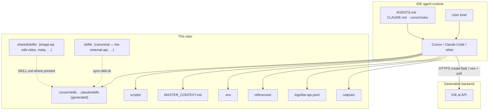
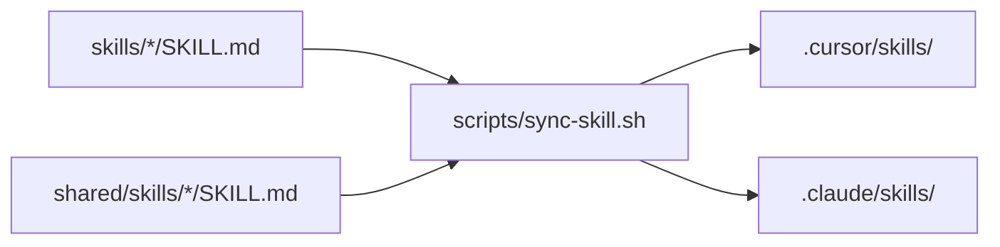
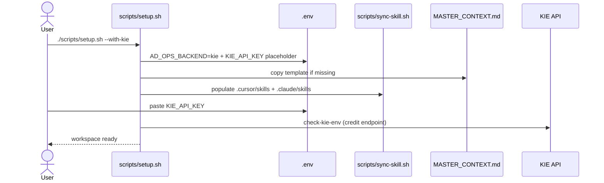
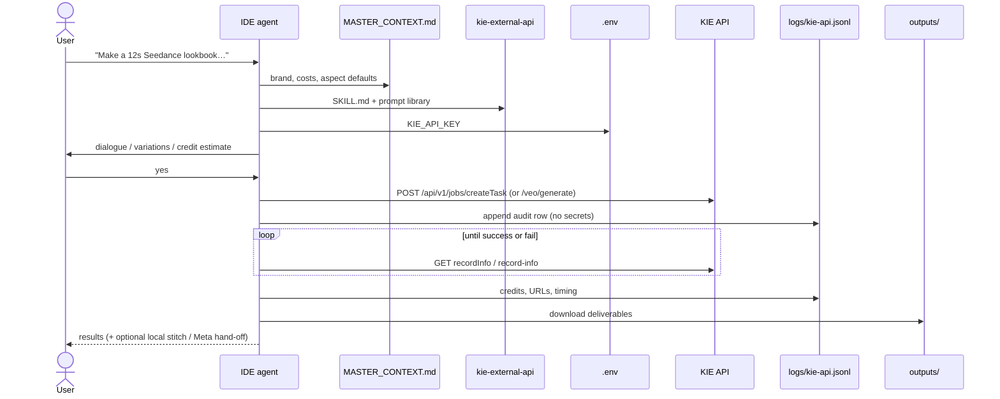
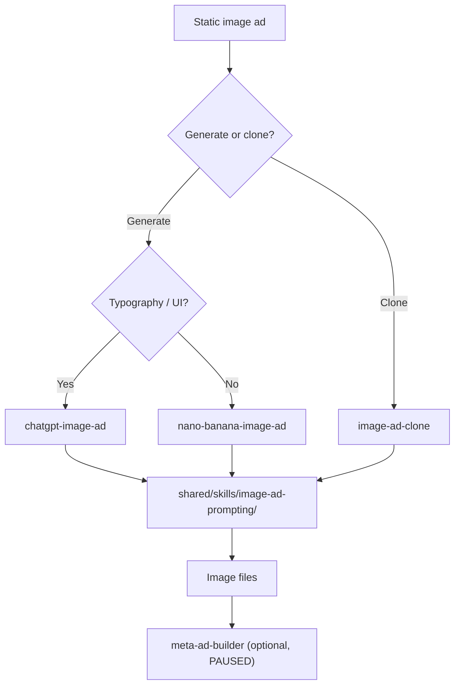

# Architecture — ad-ops-agent

How this repository works: agent runtime, skills, KIE generation, and local post.

## 1. What this system is

**ad-ops-agent** is not an application server. It is an **agent skill pack**: markdown playbooks + small scripts that an IDE coding agent (Cursor, Claude Code, Copilot-style tools) executes against generative APIs — primarily **KIE.ai**.

| Layer | Role |
|-------|------|
| **IDE agent** | Orchestrator — reads skills, asks clarifying questions, runs shell/HTTP, writes files |
| **Skill docs** | Spec — endpoints, prompt formulas, gates (credit estimate, dialogue confirm), QA rules |
| **Scripts** | Glue — setup, skill sync, env checks, image generators, ffmpeg helpers |
| **KIE.ai** | Generative backend — video/image jobs via Bearer auth |
| **Local workspace** | State — `.env`, `MASTER_CONTEXT.md`, `references/`, `outputs/`, `logs/` |



**Origins (brief):** Started from an open creative skill pack; now maintained as a **standalone** IDE ad-ops agent with KIE as the default backend.

---

## 2. Repository layout

```
ad-ops-agent/
├── skills/                         # CANONICAL — edit API / workflow skills here
│   └── kie-external-api/           #   Primary generative API skill
├── shared/skills/                  # Cross-cutting recipes (image-ad, edit-video, meta, …)
├── scripts/                        # setup, sync-skill, check-kie-env
├── .cursor/                        # Cursor hooks + rules; skills/ is generated
├── .claude/                        # Claude Code wiring; skills/ is generated
├── references/ · outputs/          # Local media (gitignored)
├── logs/                           # Generation audit trail
├── MASTER_CONTEXT.md               # Personal workspace memory (gitignored)
├── AGENTS.md / AGENTS.tail.md      # Multi-agent entry (edit the .tail)
├── CLAUDE.md                       # Claude Code session rules
└── ARCHITECTURE.md                 # This document
```

| Kind | Paths | Rule |
|------|-------|------|
| **Edit freely** | `skills/`, `scripts/`, `.cursor/rules`, `*.tail.md`, README, this file | Commit these |
| **Generated** | `.cursor/skills/`, `.claude/skills/` | Rebuilt by `./scripts/sync-skill.sh` |
| **Local secrets & memory** | `.env`, `MASTER_CONTEXT.md`, `references/`, `outputs/` | Gitignored |

---

## 3. Skill discovery



1. Canonical sources: `skills/` and `shared/skills/<name>/SKILL.md`.
2. Prompting-only shared folders (no `SKILL.md`) stay at `shared/skills/...` and are linked from skills.
3. After editing, run `./scripts/sync-skill.sh` (also run on session start).

---

## 4. First-time setup



---

## 5. Session start

| IDE | Hook | Sync |
|-----|------|------|
| **Cursor** | `.cursor/hooks.json` → `session-start.sh` | `scripts/sync-skill.sh` |
| **Claude Code** | `.claude/settings.json` `SessionStart` | same |
| **Other** | Manual | `AGENTS.md` + `./scripts/sync-skill.sh` |

Always-on Cursor rule: `.cursor/rules/project-context.mdc` → read `MASTER_CONTEXT.md`, prefer `kie-external-api`.

---

## 6. Typical generation (KIE)



**Hard gates:** credit estimate before generate; dialogue confirmation for speaking video; still QA before animating; never echo API keys into chat or `MASTER_CONTEXT.md`.

**Local post:** prefer `shared/skills/edit-video/` (soft-stitch) over regenerating when fixing joins.

---

## 7. Image-ad ecosystem



---

## 8. Where to change what

| You want to… | Change… |
|--------------|---------|
| KIE prompting / endpoints | `skills/kie-external-api/` → `./scripts/sync-skill.sh` |
| Soft-stitch behaviour | `shared/skills/edit-video/` |
| Shopify products / pages / theme | `shared/skills/shopify-store/` |
| Cursor session behaviour | `.cursor/hooks/`, `.cursor/rules/` |
| Agent blurb / identity | `AGENTS.tail.md`, README, this file |
| First-run UX | `scripts/setup.sh` |
| Brand / costs across chats | `MASTER_CONTEXT.md` (local) |

---

## 9. Trust and safety

- Secrets stay in `.env` (gitignored).
- Costs are **estimates** — confirm on [kie.ai/pricing](https://kie.ai/pricing) / [kie.ai/logs](https://kie.ai/logs).
- Meta ads via `meta-ad-builder` are **PAUSED**.
- Logs must not contain API keys or full secret-bearing prompts.

---

## 10. Related docs

| Doc | Purpose |
|-----|---------|
| [README.md](README.md) | Setup, workflows, model overview |
| [AGENTS.md](AGENTS.md) | Multi-agent operating instructions |
| `skills/kie-external-api/SKILL.md` + `reference.md` | KIE backend contract |
| `shared/skills/shopify-store/SKILL.md` | Shopify storefront workflow |
| [shared/skills/image-ad-prompting/OVERVIEW.md](shared/skills/image-ad-prompting/OVERVIEW.md) | Image-ad decision tree |
| [MASTER_CONTEXT.template.md](MASTER_CONTEXT.template.md) | Workspace memory shape |
