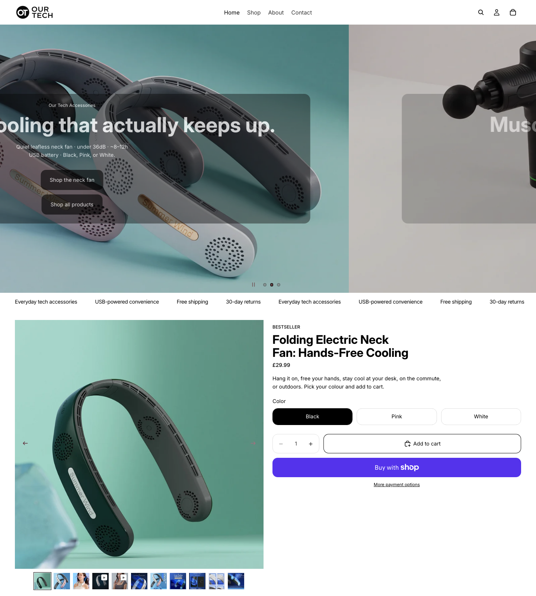
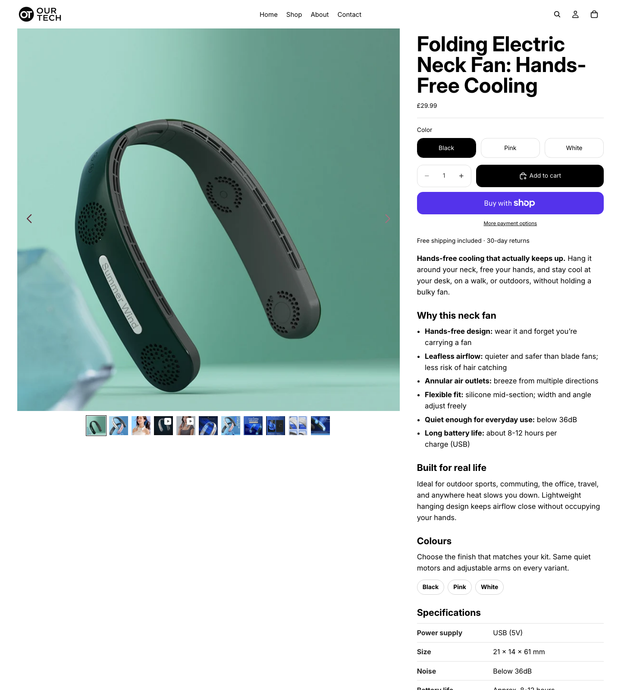
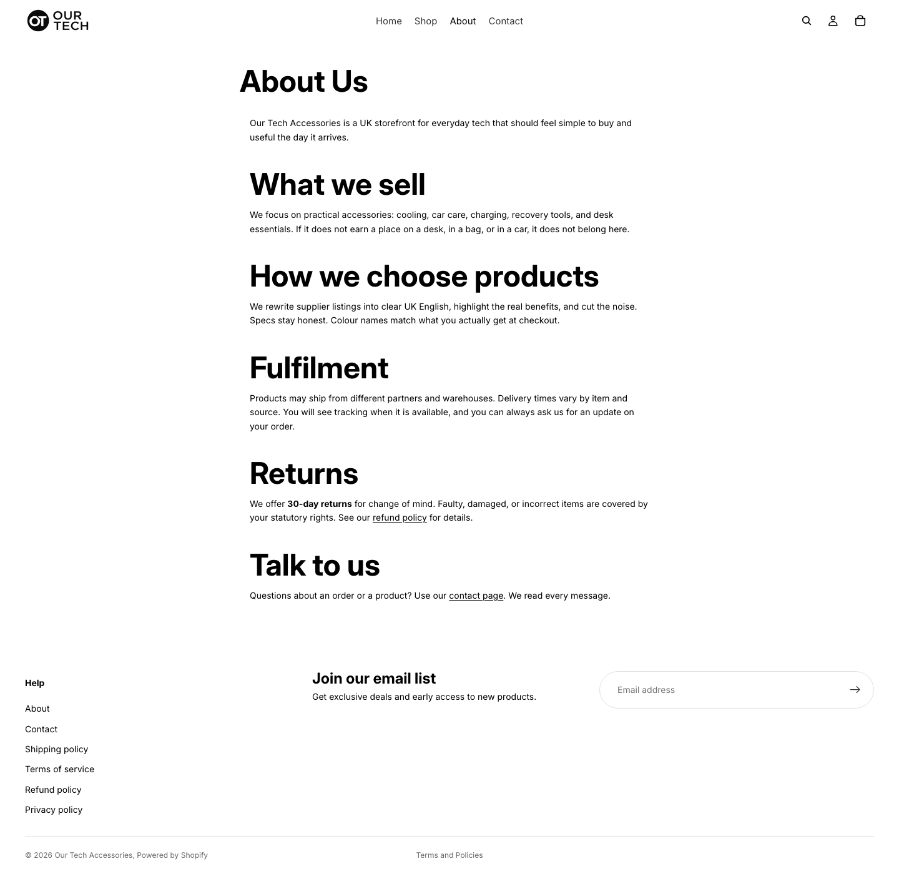
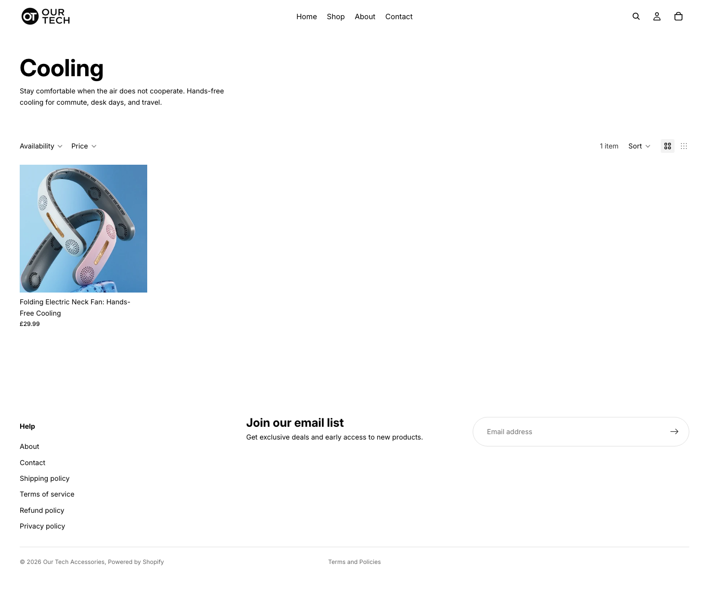
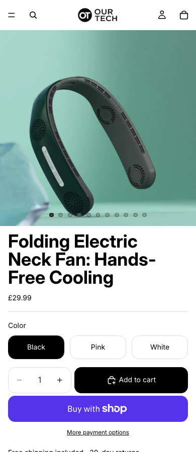

I am a lead developer in the UK. By day I ship software for a living. By evening, lately, I have been trying something less respectable: seeing whether I can make a bit of money online without turning my brain into a countdown-timer factory.

This is not a quit-your-job story. It is also not a "I cracked ecom in 30 days" story. It is a build diary. I want a calm store, a sane backend, and an honest answer to a simple question: **does this even work** if you refuse the classic dropshipping aesthetic?

## The bet: Apple calm, not carnival clutter

Most dropshipping stores I land on feel like a service-station gift aisle having a panic attack. Flash sale banners. Fake social proof. Seventeen urgency widgets. A product page that smells like it was written by three affiliate plugins in a trench coat.

I do not want that.

I want something closer to an Apple or Samsung product experience: quiet layout, clear buy path, tech that looks like it belongs on a desk or in a holiday bag, not like it escaped from a warehouse clearance bin. For the store that became [Our Tech Accessories](https://ourtechaccessories.com), that meant restrained UK English, premium-but-plain branding, and a homepage that does not beg.

Whether customers reward that preference is still an open experiment. The preference itself is not negotiable for me. If I am going to spend evenings on this, I would rather polish something I would not be embarrassed to show a friend.

## The ops desk in the repo

I did not want a pile of browser tabs and half-remembered ChatGPT prompts. I wanted the same kind of leverage I use at work: a repo, some repeatable workflows, and a paper trail.

That became **ad-ops-agent**: a project I open in Cursor and talk to in plain English. It helps with product creatives, Shopify store polish, supplier screening, and careful Meta setup. Ads stay paused until I choose otherwise, which is how a cautious engineer likes his fireworks: assembled, labelled, and not lit yet.

Is that overkill for a hobby store? Probably. It is also the only way I stay consistent after a full day of leading a team. Future-me can read what past-me decided at 11pm without relying on vibes.

## Store and backend: the part that finally feels almost real

Over a short, slightly unhinged stretch of evenings, the storefront stopped looking like a supplier import and started looking like a brand:

- Custom domain live on `ourtechaccessories.com`
- A proper logo lockup instead of "whatever Shopify defaulted to"
- Polished product pages for the hero accessories (neck fan first, then the rest of a small curated set)
- Collections, About, shipping and terms pages that say boring true things
- Free shipping called out honestly as baked into the price
- Shipping times that do **not** pretend we run a next-day UK warehouse when we do not

The About page is deliberately dull in a good way: what we sell, how we choose products, honest fulfilment, returns. No origin myth. No fake factory tour.

Collections exist so people can browse without a treasure hunt. Cooling is the obvious first stop when the hero SKU is a neck fan.

I also did the unsexy adult homework: reading into UK tax and VAT obligations so I do not sleepwalk into a mess later. I have **not** crossed some dramatic registration finish line in this story. I researched. I am paying attention. That is the honest version.

Backend-wise, the win is less "look how automated I am" and more "I can improve a product page and the store without clicking myself into a coma." Draft, review, ship. Same muscle memory as a careful deploy.

## Suppliers: QKSource, returns reality, and the CJ plot twist

Here is where the hobby got less cute.

I started with products via **QKSource**. Fine for getting inventory onto Shopify. Less fine once I sat down with their returns / dispute posture and asked a merchant-of-record question: *if a UK customer sends something back, whose process am I actually standing on?*

I am not here to do a villain monologue. Different suppliers optimise for different things. For me, the returns path was not reliable enough to keep promising a generous storefront window while fulfilment sat on that stack. Policy fit matters more than catalogue vibes.

The awkward maths was simple. If I advertised **30 days**, someone could buy, wait a week for the parcel, then refund. I would still be merchant of record. If the supplier would not cleanly cover that gap, **I** was on the hook for the difference. So the storefront dropped to the **UK 14-day** minimum: boring, legal, and less likely to quietly bankrupt the hobby.

Then the useful discovery: the same physical product family showed up on **CJ Dropshipping**. Less "random reseller island," more "oh, this is sitting on a broader parent catalogue." It looked like the same upstream stock, just with a returns / dispute path I could actually stand behind. I moved the live neck fan over to CJ, kept the customer-facing product URL stable, and put **30-day returns** back on the site the same day.

If you want the glamorous founder version of dropshipping, skip that paragraph. If you want the real version, that paragraph *is* the job.

## Ops reality: UK shipping, mobile quirks, and ads that stay paused

Building the calm store did not mean the universe cooperated.

Screening suppliers taught me that "in stock somewhere in the world" is not the same as **ships to the UK**. Some magnetic power banks looked perfect until they simply would not freight to GB. New rule for me: if it cannot reach a UK door with a straight face, it does not get a pretty product page.

Mobile taught me that tall product videos and images will gladly push your add-to-cart button into next week. I tightened the gallery so title, price, and cart sit where a thumb can find them.

I have also been generating product videos and stills with AI. Some of them are good. Some of them need another pass. That is fine: the store gets the keepers, not the outtakes.

Meta ads exist as careful, paused tests and a few organic page posts. I am not going to pretend a paused ad is a business. Infrastructure first. Proof later.

## Where I am right now

I am happier with the **site and backend** than I expected to be a few weeks ago. The store looks like the bet I wanted to make. Supplier screening is becoming a habit instead of a hope. The repo is doing real work.

I am **not** here to announce that the experiment succeeded. Side income is still a hypothesis. Curiosity is still the co-pilot. Day job is still the day job.

If you are a developer eyeing dropshipping with one eyebrow raised: same. The interesting problem, for me, is not "can I import 500 SKUs." It is "can I build a quiet buying experience on top of messy global supply chains without lying to customers or to myself."

## What I will log next

Sample orders. Whether the UK-warehouse candidates survive contact with reality. Whether paid traffic cares about calm. Whether the returns promise stays boring (the best kind of returns promise).

If this turns into anything worth copying, you will see the scars here first. If it does not, you will still get a decent diary of a lead developer spending evenings asking an awkward question out loud.

Either way, the carnival timers can stay on someone else's homepage.
