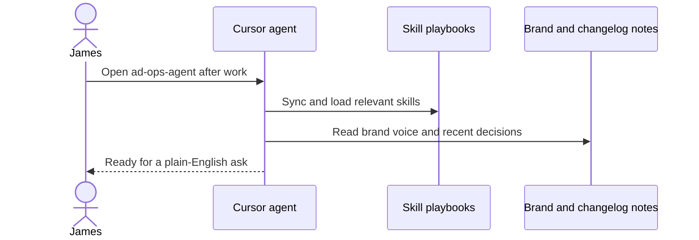
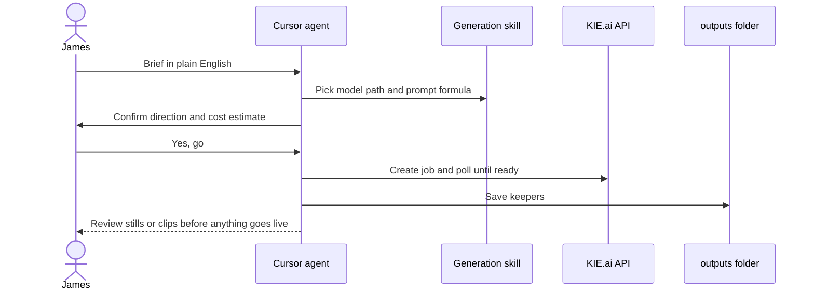
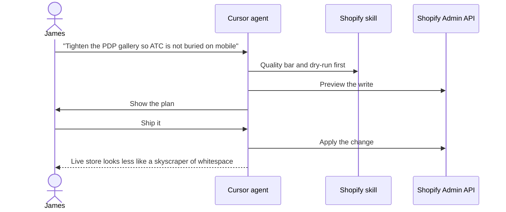
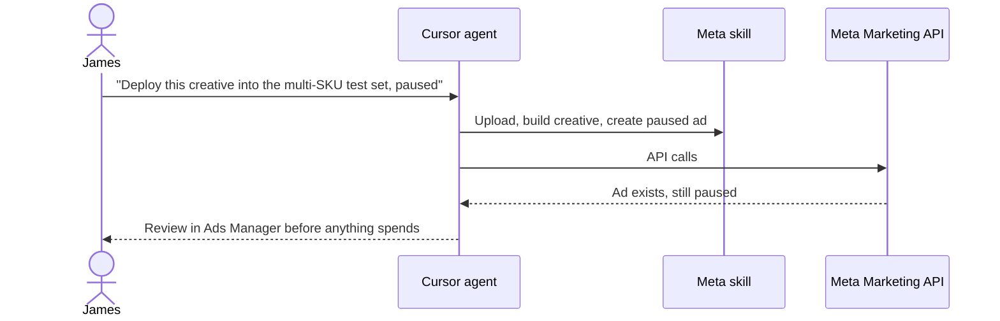

In the first Evening Ops post I talked about the bet: a calm tech store instead of a carnival of fake urgency. This one is the part I actually enjoy.

The fun bit is not the supplier spreadsheet. It is sitting in Cursor after work, talking to a repo that knows how I run [Our Tech Accessories](https://ourtechaccessories.com), and watching a half-formed evening ask turn into creatives, a storefront tweak, or a carefully paused Meta ad.

That repo is **ad-ops-agent**. It is my ops desk. Skills, scripts, brand notes, and a paper trail. Not a SaaS dashboard I have to relearn every weekend.

## Credit where it is due

I did not invent this idea from thin air.

The creative workflow patterns and prompt libraries started in an open skill pack by **[Mr. Paid Social](https://www.skool.com/mrpaidsocial)** (Caleb Kruse). I forked that thinking into a project I could keep evolving for my own store: KIE as the default generative path, Shopify and Meta wired in, blog posts living in the same repo as the work.

If you like the "agent reads a skill and calls an API" shape, that DNA is his. What follows is how I am using and bending it for evenings after a lead-dev day job.

## Why these platforms: I can call them from the chat

I am picky about tools for a boring reason. If I cannot drive something from Cursor with an agent that follows a skill, I will eventually stop using it after a long day.

So the stack bias is simple:

| Surface | Why it is here |
|---------|----------------|
| **KIE.ai** | One API key for video and still generation. The agent can create a job, poll it, download the file, log what happened. |
| **Shopify** | Admin API for products, pages, metafields, theme bits. Draft, review, ship. Same muscle as a careful deploy. |
| **Meta** | Marketing API for uploading creatives and building **paused** ads. Fireworks assembled, not lit. |
| **CJ Dropshipping** | Product search and screening with an API, so "can this ship to the UK?" is not vibes. |
| **Hashnode** | This diary. GraphQL draft-first publish from the same repo that produces the store work. |

There are prettier UIs for all of these. I already spend my day in an IDE. The win is **one chat thread** that can read brand voice, follow a playbook, call an API, and leave artifacts under `outputs/` for future-me.

If a platform only works through a clicky console with no sane API, it is fighting the whole point of this experiment.

## What a "skill" is in this repo

A skill is not magic. It is a markdown playbook plus, often, a few scripts.

When I open the project, Cursor syncs those playbooks into a place the agent can see. I say something in plain English. The agent picks a skill, reads the rules, asks the boring clarifying questions, estimates cost when generation is involved, then runs.

I also keep a local **master context** file: brand tone, defaults, and a changelog of what we actually decided. That is the difference between "generic AI ecommerce tips" and "our store, our voice, our paused ad set."

The important cultural bit: **skills are allowed to change**. When a workflow is wrong, we fix the skill or add a script. The next evening inherits the fix. That is how this stays sane instead of becoming a graveyard of one-off chat history.

## What I have wired (the short tour)

Rough map of the desk today:

- **Generation:** video and image creatives through KIE, with prompting guides so I am not reinventing UGC every night
- **Image ads:** three related skills: typography-heavy statics, photoreal / lifestyle statics, and "clone this existing ad into a reusable template"
- **Local edit:** soft-stitch clips with ffmpeg when a cut is ugly and regenerating would be silly
- **Shopify:** storefront updates with a dry-run habit before writes
- **Meta:** research helpers, copy support, deploy creatives as paused ads; lately even an Ad Library research browser so I can cite competitor creatives in chat
- **Suppliers:** CJ screening for UK/EU-shaped inventory decisions
- **Inbox:** `hello@` triage so pitch spam does not eat the hobby
- **This blog:** journey posts drafted from `blog/posts/`, same repo, same evening

I do not use every skill every night. I use the ones that match the ask. The rest sit quietly until they are useful.

## How an evening actually flows

Here is the pattern, without pretending every arrow is glamorous.

### Session start

### Creative generation

### Storefront change

### Meta hand-off (still cautious)

That last diagram is the whole personality of the project: automate the fiddly bits, keep a human on the spending switch.

## Example prompts I actually type

These are the sort of lines that start a session. Not polished prompts. Just how I talk to the desk.

**Creative**

> Make a calm 1:1 product still for the retractable GaN charger, UK plug only, desk lifestyle, no carnival badges. Show me options before we animate anything.

**Clone / research**

> Sweep the Ad Library for GB neck fan and GaN charger competitors, then build the research browser so I can point at specific ads in chat.

**Storefront**

> Update the charger PDP: honest shipping copy, collections for charging and desk, dry-run first. Keep the tone restrained UK English.

**Meta**

> Upload the approved collage into the Multi SKU creative test ad set as a paused ad. Two primary text variants. Do not unpause.

**Ops / tracking**

> Our first paid order did not show as a Meta Purchase. Diagnose native Shopify sharing versus a CAPI backfill. Do not turn this into a second tracking SaaS.

**Blog**

> Write the second Evening Ops post about the repo setup, skills, and why I picked API-first platforms. Credit the original skill-pack author. Mermaid diagrams welcome.

Notice the pattern: outcome first, constraints second, "show me before you spend or publish" almost always implied. When the agent invents a useful script along the way, we keep it. When a skill was wrong about an API quirk, we patch the skill. The chat is temporary. The skill is the product.

## Scale thesis (unproven, on purpose)

I am trying to build this so that a second store, or a new niche, is mostly:

1. New brand notes and defaults
2. New references and products
3. Same skills, same APIs, same "plain English → dry-run → ship" loop

In theory that should be cheaper on my sanity than rebuilding a click-ops religion for every catalogue. In practice that is still a hypothesis. One calm UK accessories store does not prove a franchise of calm UK accessories stores.

What I *do* know: after a full day of leading engineers, I will not maintain twelve browser tools and a Notion wiki of half-remembered prompts. I will maintain a repo. Maybe.

## Where this leaves me

The store from post one is the customer-facing bet. This repo is the operator-facing bet.

If the operator bet works, evenings stay interesting and the carnival stays on someone else's homepage. If it does not, I will still have a diary of a developer who tried to treat side-project commerce like a small, careful codebase.

Next up in the log: more contact with reality. Sample orders. Whether paid traffic cares about calm. Whether the "new niche, same desk" idea survives the first awkward attempt.

If you are forking thinking from [Mr. Paid Social](https://www.skool.com/mrpaidsocial) too: thank him, then make the skills yours. That last part is the whole game.
